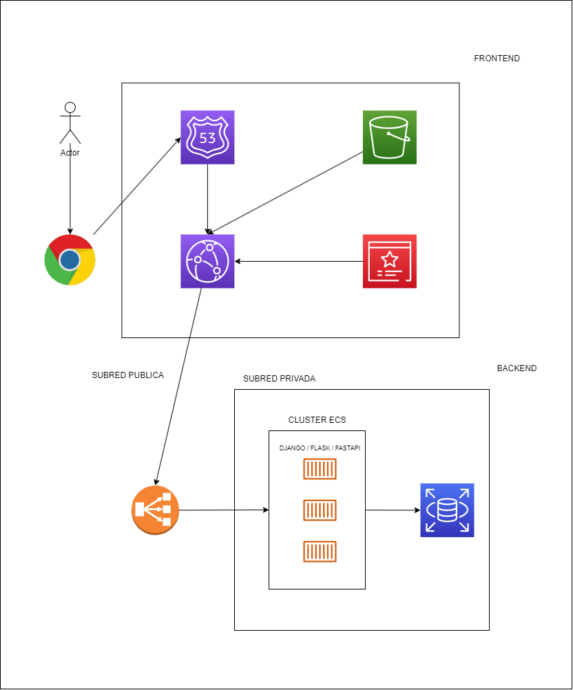

##### Índice
1. Consideraciones
2. Hablando sobre AWS y este proyecto
3. Lambda
4. Pasos para ejecutar este proyecto
5. Pasos para utilizar este proyecto
6. Palabras finales

### Consideraciones

1. Decidí crear el UI yo mismo porque la vacante mencionaba que era necesario saber reactjs jeje. Sin embargo me aproveché de la ambiguedad de los requerimientos para soslayar cuestiones de seguridad tácitos en cualquier interfaz de usuario
2. Utilicé mucho código que hago en mi diario vivir, por lo que realmente eso sería lo interesante de mirar. Por ejemplo en el backend hay algunos módulos que utilizo para ahorrar tiempo cargando data dummy (`transito_backend/utilities/initial_data/data_creator.py`). Es por ese motivo que utilizo módulos como pandas etc (que en un proyecto pequeño como este no sería para nada necesario). De la misma manera hay otros comandos que he creado para django a lo largo del tiempo, para generar código automáticamente etc, pueden verlos en el mismo directorio /utilities.
3. Utilicé Django aunque en la vacante se menciona el uso de funciones lambda, eso se cubrirá mas adelante. Este repositorio no contiene código para funciones lambda, pero tengo este que puede ser interesante revisar https://github.com/JhonSanz/lambda_docker_graphql

### Hablando sobre AWS y este proyecto

Si bien Django es un framework bastante bueno, con el tiempo he visto que ha dejado de utilizarse bastante y el mercado se ha movido a otros mas dinámicos como Flask o FastApi, los cuales tienen ventajas evidentes al ser mas abiertos y permitir la incorporación de liberías mas facilmente. 

Un ejemplo claro son las librerías de graphQl, incorporar esto en django no es tan facil, o quizás alguna locura como utilizar otro ORM también sería un lío divertido. 

Sin embargo, el hecho de utilizar cualquiera de estos framework mencionados anteriormente implica asumir los costos de tener una aplicación corriendo 24/4. Lo cual afecta directamente el despliegue en la nube. Por lo cual:

1. Hay que decidir si vamos a utilizar instancias EC2 o servicios autoadministrados como Fargate, esto es muy importante ya que los costos en dinero y horas hombre varían dramáticamente. Con las instancias debemos hacernos cargo de la administración del servidor, actualizaciones etc. con fargate todo es automático.
2. Aquí se utilizó una base de datos de desarrollo sqlite3 pero eso no se puede hacer en producción. La base de datos también es una decisión basada en el dinero, ya que aquí hay muchas opciones. Algo que se ve mucho es instalar postgres directamente en la instancia o con una imagen de docker, ya que los servicios autoadministrados son bastante caros. Para una app pequeña considero correcto agregar la base de datos directamente en la isntancia y hacer copias de seguridad, hasta que nuestra app genere mas dinero xd

Aquí hay un diagrama sobre una posible implementación en AWS. Podemos ver un balanceador de carga en una subred pública, el cual se comunica con las tasks de nuestro backend, las cuales viven dentro de un cluster ECS. Desde el navegador nuestros usuarios se conectan mediante Cloudfront, el cual sirve nuestros estáticos hechos con react :)

3. Evidentemente una arquitectura con kubernetes es posible, pero no tengo experiencia con esta tecnología

### Lambda

Finalmente, hablar sobre lambda es hablar sobre "cobro por uso" y en este caso es atractivo utilizar este servicio, porque no necesariamente nuestros usuarios van a estar utilizando todo el tiempo nuestra app. 

Si bien hay que enfrentar el cold start en Lambda, para hacer APIs me parece muy bien. Hay cuestiones filosóficas sobre si es mejor crear una función por url, o una función lambda para todas las urls. 

También está el problema de utilizar las bases de datos con lambda, ya que lo primero que viene a la mente es utilizar RDS, pero si no tenemos suficiente flujo de plata no creo que sea una buena idea.

Sin embargo mi experiencia ha sido buena con lambda, utilizar las librerías de IaC como CDK hace que esto sea una experiencia satisfactoria ya que se automatizan muchas cosas. Mi repo contiene algunas cositas que hice con lambda, strawberryGraphql, Apigateway etc. Aqui se puede ver https://github.com/JhonSanz/lambda_docker_graphql

### Pasos para ejecutar este proyecto

1. Tener docker instalado
2. Correr `docker compose -f docker_compose.yml up`
3. Disfrutar

### Pasos para utilizar este proyecto

- El usuario con privilegos de administrador es:
> username: admin, password: Hola123...

- Los usuarios que pueden registrar infracciones inicialmente son:

| username  | password   |
| --------- | ---------- |
| Policia 1 | 8291635475 |
| Policia 2 | 5588446621 |
| Policia 3 | 6985471203 |
| Policia 4 | 3512468795 |
| Policia 5 | 1234567890 |

Pero al crear un officer nuevo este puede registrar infracciones.

- Los correos de las personas registradas en el sistema son:

| email          |
| -------------- |
| pedro@mail.com |
| p2@mail.com    |
| p3@mail.com    |
| p4@mail.com    |
| p5@mail.com    |
| p6@mail.com    |

- Toda la data pregarcada está en el archivo `transito_backend/utilities/initial_data/data_infracciones.xlsx`

### Palabras finales

- Se subieron las imagenes del backend y frontend al repositorio público de dockerhub.
- No identifiqué errores, pero de haberlos tengan piedad hahaha, agradecería que me reporten si algo llega a fallar.
- Gracias totales